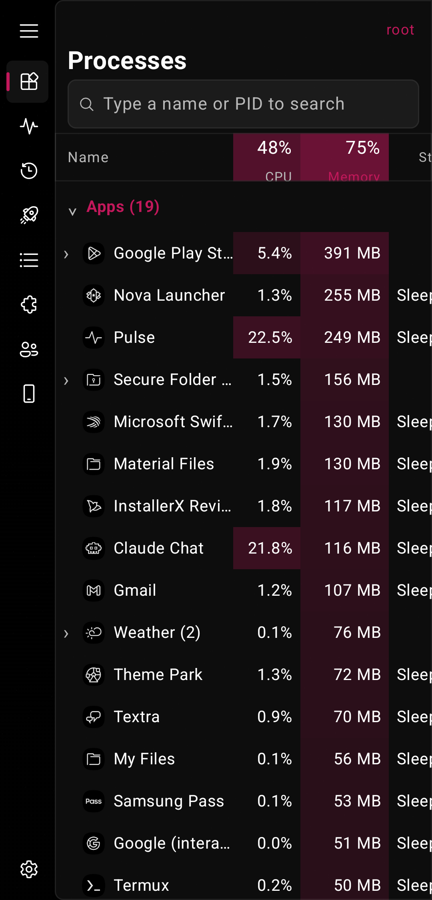
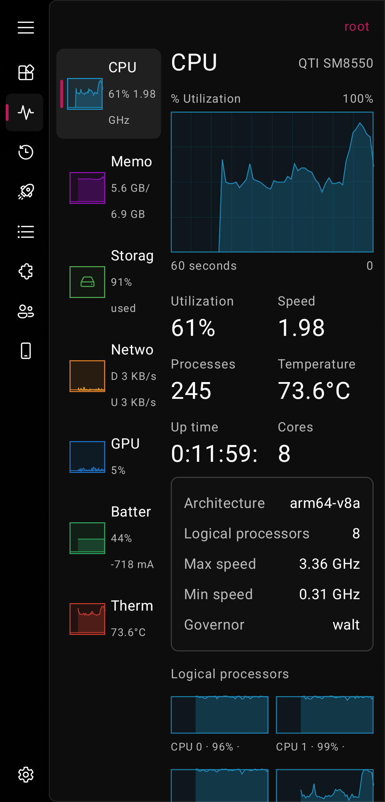
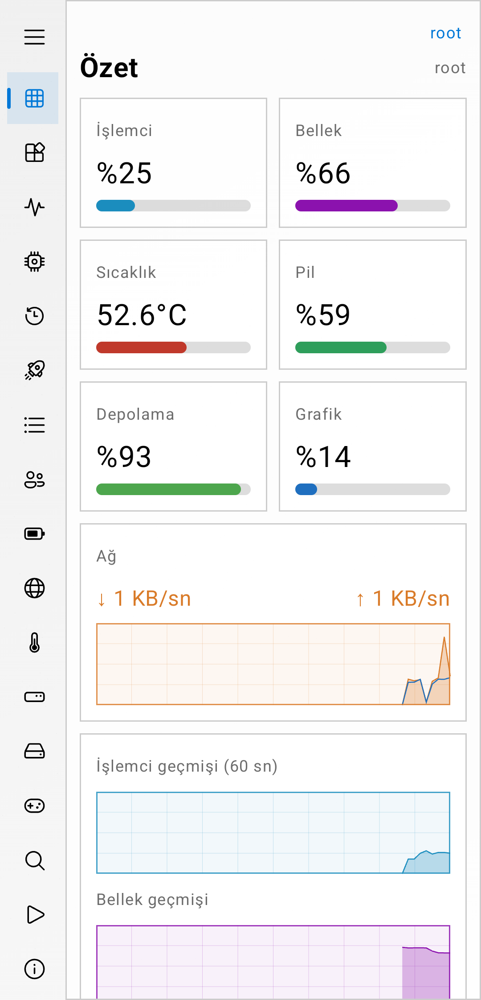
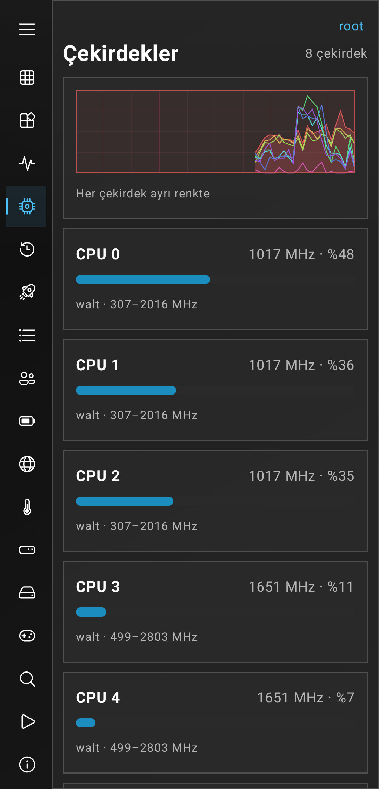

# Pulse

A task manager for Android that looks and works like the Windows one, plus a full browser for everything your phone knows about itself.

I wanted Task Manager on my phone: a process list with heat-map cells, a Performance tab with live graphs, startup apps, services. Then I kept adding the things I wish a system app showed: sensors, camera details, battery health, thermals, a floating monitor. This is the result.

> No data is shared. Pulse reads your phone's numbers on the phone and keeps them there. The only network use is the latency test, and only when you press Start.

## Screenshots

| Processes | Performance | Overview (light) | Cores (dark) |
|---|---|---|---|
|  |  |  |  |

## What is in it

**Task Manager side**
- **Processes**: Apps and Background processes in groups, CPU and memory with heat-map cells, totals in the column heads, End task.
- **Performance**: a list of CPU, Memory, Storage, Network, GPU, Battery and Thermal on the left, the big graph and the numbers on the right.
- **App history**, **Startup apps** (switch boot receivers off with root), **Details**, **Services**.
- **Apps**: search, filter, sort by size, date or permissions, open, app settings, uninstall, force stop.

**Guardians** (tabs along the top: Thermal, Battery, Storage, Memory)
- One detailed page each, the idea of Samsung's Good Guardians for any phone: a gauge and a plain verdict, 30-minute graphs, and the numbers behind them.
- **Thermal**: the hottest sensor, battery temperature, every thermal zone grouped (processor, graphics, battery, device, radio) with bars, and the processor's speed per core against its top speed, so you can see when it slows down to cool off.
- **Battery**: charge, current and power graphs, time left (or to full), power source, condition, charge cycles and capacity against new.
- **Storage**: used and free, disk read/write traffic, where the space goes by folder, the biggest app data folders and cache trimming (root).
- **Memory**: in use / cached / free, a 30-minute graph, the biggest apps and quick actions.

**Menus**
- File, Options, View and Help work like Task Manager's: run a new task (a command, or an app's package name), share a report, keep the screen on, floating monitor, update speed, temperature unit. The modern looks keep them behind the "⋮" at the top right.

**Device module** (tabs along the top)
- Overview, System, CPU and per-core frequencies and governors, Memory, Storage with folder sizes, Battery, Network with a latency test, Thermal, Display with a live frame-rate graph, Camera, Sensors, Media and DRM, hardware features, system properties and a short benchmark.

**Always on**
- A floating monitor over other apps, live numbers in a notification, alerts for temperature, low battery and high memory, and a Quick Settings tile.
- A one-tap report of everything, to share or copy.

## Looks

Windows 11 (with Mica, Mica Alt, Acrylic or Glass), Windows 10, Windows 7, XP and 95, Material You and AMOLED. Light, dark or follow the system. The dark themes are close to AMOLED black. Mica is only on the Windows 11 look, as it was on Windows.

## Root

Pulse works without root. Root adds the full process list, per-core data, services, startup switches and the quick actions. Everything else (memory, battery, network, device info) works as a normal app.

## Install

Download the APK from the releases page, or build it yourself.

Needs Android 10 or newer.

## Build

```
gradle assembleRelease
```

Kotlin and Jetpack Compose, no other services.

## Credits

Icons in the Windows themes are Microsoft's Fluent System Icons (MIT).

Made by [UmutK](https://github.com/xUmutKx).
